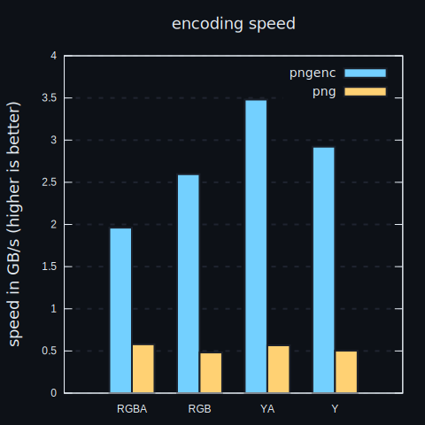

# pngenc

encode your pngs, uncompressed

## rationale

well, you see, sometimes pngs dont need to be compressed? what do you mean you want to send them over the network? well, what if, like, you have to encode a png, but then you just run a compressor over it? double the work, innit? just directly talk to the compressor? well, youve got me now, but, still, ya know, maybe you wanted to write a uncompressed png just for kicks anyways? like, the png is temporary? maybe you wanted to send them to your iterm2 apple terminal and didnt want to bother spending time waiting for compression? eeeh? yeah, now ive got you.

### sped

ya see, it does do plenty of speeding

